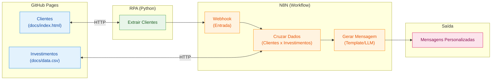

# Criando um Assistente de Investimentos com RPA e IA Generativa

## Descrição

Aprenda na prática como criar um fluxo de automação inteligente combinando técnicas de RPA (Robotic Process Automation) com workflows de IA no N8N.

Neste desafio, você vai construir um assistente de investimentos automatizado. O fluxo começa com a extração de dados de clientes em uma página web usando Python, passa pela orquestração de um workflow no N8N e termina com a geração de mensagens personalizadas para cada perfil de investidor.

O projeto foi pensado para ser simples e acessível, mesmo para quem está dando os primeiros passos em Python e automação. A ideia é que você entenda o conceito de RPA de forma leve e aplique tudo em um cenário realista do mercado financeiro.

## Objetivo do Projeto

Desenvolver um pipeline de automação que:

1. **Coleta dados de clientes** de uma página web simulada usando Python
2. **Processa as informações** através de um workflow no N8N
3. **Cruza perfis de investidor** com uma base de opções de investimento
4. **Gera mensagens personalizadas** para cada cliente

Ao final, você terá um sistema funcional que demonstra como empresas do setor financeiro podem automatizar a comunicação com clientes de forma inteligente.

## Arquitetura do Projeto



## Tecnologias e Ferramentas

O projeto utiliza ferramentas gratuitas e acessíveis, organizadas conforme cada etapa do fluxo:

| Etapa | Ferramenta | Função |
|-------|-----------|--------|
| Hospedagem | GitHub Pages | Servir a página de clientes e o CSV de investimentos |
| Extração (RPA) | Python + BeautifulSoup | Coletar dados dos clientes via web scraping |
| Orquestração | N8N | Processar dados, cruzar perfis e gerar mensagens |
| Geração com IA | Agente de IA no N8N | Criar mensagens personalizadas com LLM (desafio extra) |

> [!TIP]
> Além dessas, você pode usar IAs generativas como **Gemini**, **Claude** ou **ChatGPT** como copilotos para auxiliar na escrita de código e tirar dúvidas ao longo do desenvolvimento.

## Roteiro do Desafio

### Etapa 1: Prepare o Ambiente

1. Crie um repositório público no GitHub
2. Ative o GitHub Pages nas configurações (apontando para a pasta `docs/`)
3. Crie uma conta no [N8N Cloud](https://n8n.io/) ou instale localmente
4. Acesse o [Google Colab](https://colab.research.google.com/) para desenvolver o script Python

### Etapa 2: Crie a Página de Clientes

Monte uma página HTML simples (`docs/index.html`) com uma lista de clientes fictícios. Cada cliente deve ter:

- Nome
- Email
- Saldo disponível
- Perfil de investidor (Conservador, Moderado ou Arrojado)

### Etapa 3: Desenvolva o Script de RPA

Crie um notebook Python no Google Colab que:

1. Acesse a página de clientes hospedada no GitHub Pages
2. Extraia os dados de cada cliente usando BeautifulSoup
3. Envie os dados em formato JSON para o webhook do N8N

Mantenha o código simples. O objetivo é aprender o conceito, não criar algo complexo.

> [!NOTE]
> **Por que isso é RPA?** Nosso script faz exatamente o que um humano faria manualmente: abre uma página, lê os dados de uma tabela e os envia para outro sistema. A diferença é que o "robô" (código) executa isso automaticamente. Essa abordagem é útil quando não existe uma API disponível ou quando precisamos integrar sistemas legados.

### Etapa 4: Configure o Workflow no N8N

Monte um fluxo que:

1. Receba os dados dos clientes via Webhook
2. Leia o arquivo `docs/data.csv` com as opções de investimento
3. Cruze o perfil de cada cliente com a opção adequada
4. Gere uma mensagem de recomendação para cada cliente

### Etapa 5 (MVP): Mensagens Estáticas

Para a versão mínima, use templates de mensagem fixos baseados no perfil:

- **Conservador:** Foco em renda fixa e segurança
- **Moderado:** Mix equilibrado entre renda fixa e variável
- **Arrojado:** Ênfase em ações e maior potencial de retorno

### Etapa 6 (Desafio): Integração com IA Generativa

Conecte o Agente de IA do N8N a um modelo como Gemini ou GPT para:

- Analisar o contexto do cliente (saldo, perfil)
- Gerar mensagens únicas e personalizadas
- Criar recomendações mais inteligentes e humanizadas

## Entregáveis

### MVP (Mínimo Viável)

- [ ] Repositório público no GitHub com README documentado
- [ ] Página HTML funcionando no GitHub Pages (`docs/index.html`)
- [ ] Arquivo CSV com opções de investimento (`docs/data.csv`)
- [ ] Notebook Python de extração (`src/extrair_clientes.ipynb`)
- [ ] Workflow N8N com mensagens estáticas

### Desafio Completo

- [ ] Todos os itens do MVP
- [ ] Integração com Agente de IA no N8N
- [ ] Mensagens geradas dinamicamente via LLM
- [ ] Documentação explicando as decisões técnicas

## Estrutura Sugerida do Repositório

```
📁 dio-lab-assistente-investimentos-rpa-n8n/
├── 📄 README.md
├── 📁 src/
│   └── 📄 extrair_clientes.ipynb   # Notebook Python (Google Colab)
├── 📁 n8n/
│   └── 📄 workflow.json            # Exportação do workflow N8N
└── 📁 docs/
    ├── 📄 index.html               # Página de clientes (GitHub Pages)
    └── 📄 data.csv                 # Opções de investimento (GitHub Pages)
```

## Prompts Úteis para Copilotos de IA

| Tarefa | Sugestão de Prompt |
|--------|-------------------|
| Gerar dados fictícios | "Crie 10 clientes fictícios com nome, email, saldo e perfil de investidor em JSON" |
| Entender código | "Explique o que faz a biblioteca BeautifulSoup em Python" |
| Debugar erros | "Meu script Python está dando erro X, o que pode ser?" |
| Montar workflow | "Como configuro um webhook no N8N para receber dados JSON?" |

## Recursos de Apoio

- [Documentação do N8N](https://docs.n8n.io/)
- [BeautifulSoup - Web Scraping com Python](https://realpython.com/beautiful-soup-web-scraper-python/)
- [GitHub Pages - Guia Rápido](https://pages.github.com/)

---

**Bons estudos e mãos à obra** 🚀

Se tiver dúvidas, lembre-se: a melhor forma de aprender é experimentando. Erre, corrija e celebre cada pequena vitória no caminho.
